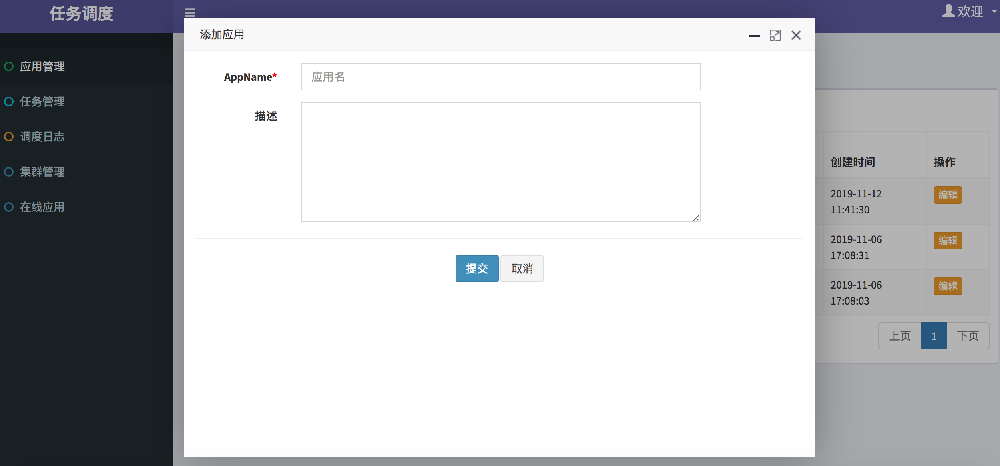
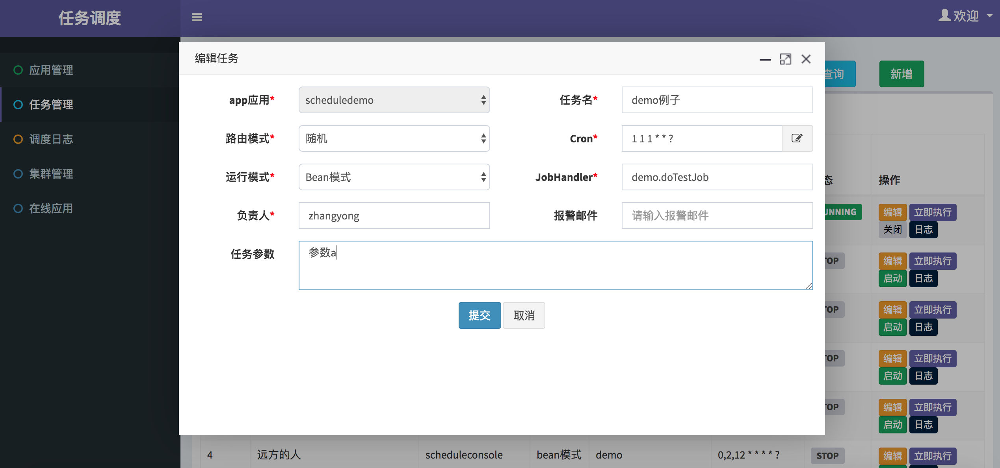

# 任务调度系统

## 简介

  它为您提供秒级，分布式的定时（基于 Cron 表达式）任务调度服务。
  特点:
  1  采用rocketmq remoting通讯协议(做了些许改动 ，去掉)
  2  没有使用quartz,而使用hashedwheeltimer来实现调度
  3  当前支持master slave模式,后续会实现raft自动选主的功能

## 工作原理

Schedule有三个组件，schedule-console、schedule-server 和 schedule-client。


  schedule-console 是 Schedule 的控制台，用于创建、管理定时任务。负责数据的创建、修改和查询。在产品内部与 schedule server 交互。
  schedule-server 是 Schedule 的服务端，是 Scheduler的核心组件。负责客户端任务的调度触发以及任务执行状态的监测。
  schedule-client 是 Schedule 的客户端。每个接入客户端的应用进程就是一个的 Worker。
  Worker 负责与 schedule-server 建立通信，让 schedule-server 发现客户端的机器。
  并向 scheduler-server 注册当前应用所在的分组，这样 scheduler-server 才能向客户端定时触发任务。

## quick start

1 打包

```
   mvn clean package
```

2  部署 schedule-server

```
    nohup java -jar -Dspring.profiles.active=prod scheduleserver.jar &
```

3  部署 schedule-console

```
   nohup java -jar -Dspring.profiles.active=prod scheduleconsole.jar &
```

## 控制台console

1  添加应用
   

2  管理集群
   

3  添加任务
   

## 接入调度系统
 1 参看 schedule-demo
   jar包依赖:
```
 <dependency>
        <artifactId>schedule-client</artifactId>
        <groupId>com.courage</groupId>
        <version>${parent.version}</version>
 </dependency>
```

   


2  注解添加执行服务


